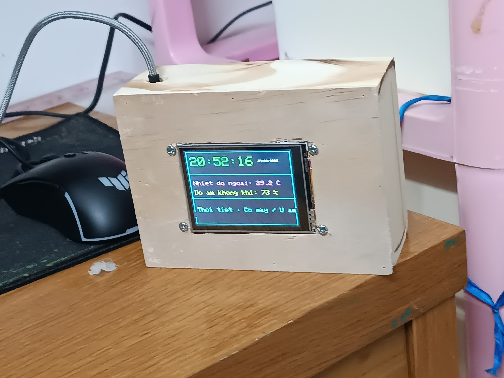
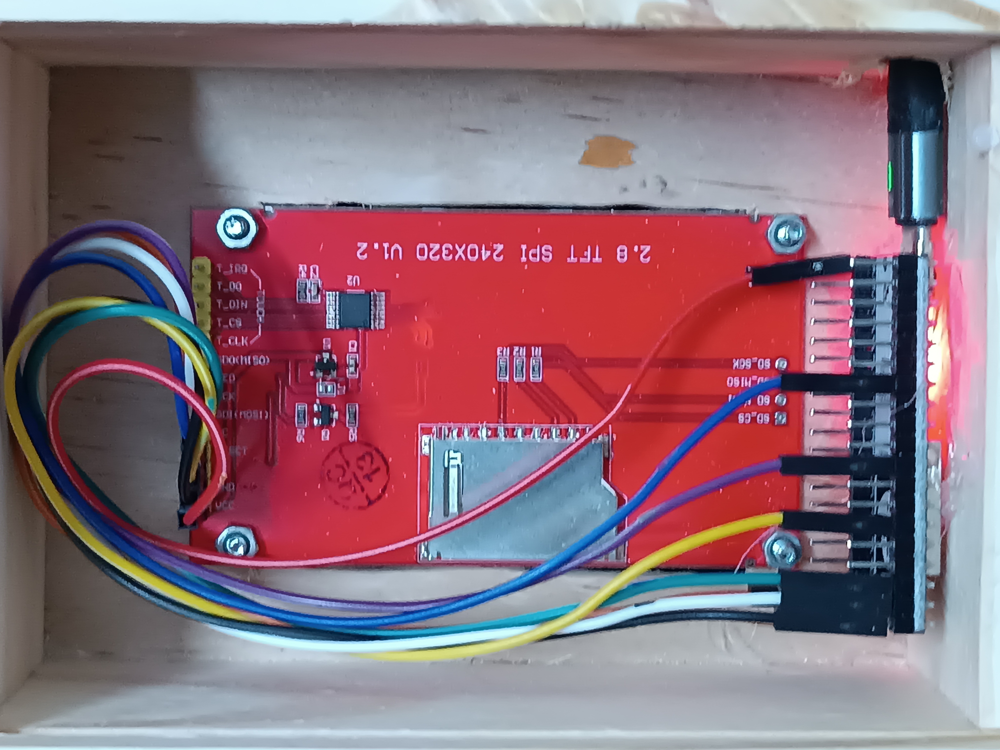

Mình đang tự học ESP32 ở nhà, nên là có mua đồ từ trên shopee.

Hiện tại mình đang có 1 cái màn hình TFT 2.8 inch 240 x 320, 1 con NodeMCU ESP32, loại CP2102 có 38 PIN sử dụng type c. Con này thì nó có thể kết nối tới wifi. Thực ra chỉ cần 8 dây là đủ để nối rồi, nhưng mà để chắc ăn thì mình mua khoảng 20 dây (Nói chung là chưa quen nên cho nó chắc o(*￣︶￣*)o.)

Đồng thời là 1 cái hộp gỗ để đựng toàn bộ bo mạch. Mình không biết hàn nên mới mua combo như thế này :b.

Đây là khi mình làm xong nè



*Trang trí để sau*

Bắt tay vào dự án, thì ta cần vạch ra là sẽ làm gì trước.

Mạch ESP32 sẽ đóng vai trò như là một bộ não, tiếp nhận dữ liệu qua dây out để xử lý rồi truyền đi đến đúng nơi.

Tất cả những bộ phận trên sẽ được lắp đặt vào một cái hộp gỗ.

Mình đã cắt phần trước của cái hộp gỗ sao cho vừa với cái màn hình, xong bạn sẽ để ý là cái màn hình tft có chỗ để bạn bắt vít. Để có thể cắt thì các bạn có thể sử dụng một các cưa gỗ loại nhỏ hoặc như mình, mua một cái combo máy mài khắc trên mạng ấy. Đâu đấy có 160K thôi.

Bảng mình nối dây giữa các đầu của esp và màn tft

| Thứ tự | ESP32    | TFT ILI9341   |
|--------|----------|---------------|
| 1      | 5V       | VCC           |
| 2      | GND      | GND           |
| 3      | GPIO 21  | CS            |
| 4      | GPIO 22  | RESET(RST)    |
| 5      | GPIO 4   | DC(RS)        |
| 6      | GPIO 23  | SDI(MOSI)     |
| 7      | GPIO 18  | SCK(CLK)      |
| 8      | 3V3      | LED           |

Đây là full code

```cpp
#include <Arduino.h>
#include <WiFi.h>
#include <HTTPClient.h>
#include <ArduinoJson.h>
#include <time.h>
#include <SPI.h>
#include <Adafruit_GFX.h>
#include <Adafruit_ILI9341.h>

// --- 1. THÔNG TIN WIFI & TOẠ ĐỘ ---
#define WIFI_SSID     "YOUR_WIFINAME"   // Đổi lại tên WiFi
#define WIFI_PASS     "YOUR_WIFIPASSWORD"      // Đổi lại mật khẩu
// Sử dụng các dịch vụ map để có thể lấy vị trí của bạn
#define LATITUDE      "YOUR_LOCATION"
#define LONGITUDE     "YOUR_LOCATION"

// --- 2. CẤU HÌNH MÀN HÌNH TFT ---
#define TFT_CS   21
#define TFT_DC   4
#define TFT_RST  22
Adafruit_ILI9341 tft = Adafruit_ILI9341(TFT_CS, TFT_DC, TFT_RST);

// Cấu hình múi giờ Việt Nam (UTC+7)
const long gmtOffset_sec = 7 * 3600; 
const int  daylightOffset_sec = 0;

float outdoorTemp = 0.0;
int outdoorHumidity = 0;
String weatherDesc = "Dang cap nhat";
unsigned long lastApiCheck = 0;

// Hàm dịch mã thời tiết sang tiếng Việt
String getWeatherText(int code) {
  if (code == 0) return "Troi quang";
  if (code >= 1 && code <= 3) return "Co may / U am";
  if (code == 45 || code == 48) return "Co suong mu";
  if (code >= 51 && code <= 55) return "Mua phun";
  if (code >= 61 && code <= 65) return "Mua rao";
  if (code >= 80 && code <= 82) return "Mua to";
  if (code >= 95) return "Co dong bao";
  return "Nhieu may";
}

void fetchOpenMeteo() {
  if (WiFi.status() == WL_CONNECTED) {
    HTTPClient http;
    http.setTimeout(4000); 
    
    String url = "http://api.open-meteo.com/v1/forecast?latitude=" + String(LATITUDE) + 
                 "&longitude=" + String(LONGITUDE) + 
                 "&current=temperature_2m,relative_humidity_2m,weather_code&timezone=Asia%2FBangkok";
    
    http.begin(url);
    int httpCode = http.GET();
    
    if (httpCode == HTTP_CODE_OK) {
      String payload = http.getString();
      StaticJsonDocument<768> doc;
      DeserializationError error = deserializeJson(doc, payload);
      
      if (!error) {
        outdoorTemp = doc["current"]["temperature_2m"];
        outdoorHumidity = doc["current"]["relative_humidity_2m"];
        int wCode = doc["current"]["weather_code"];
        weatherDesc = getWeatherText(wCode);
      }
    }
    http.end();
  }
}

void setup() {
  Serial.begin(115200);

  tft.begin();
  tft.setRotation(1); 
  tft.fillScreen(ILI9341_BLACK);

  tft.setCursor(20, 100);
  tft.setTextColor(ILI9341_WHITE);
  tft.setTextSize(2);
  tft.print("Dang ket noi WiFi...");

  WiFi.mode(WIFI_STA);
  WiFi.begin(WIFI_SSID, WIFI_PASS);
  
  int retry = 0;
  while (WiFi.status() != WL_CONNECTED && retry < 25) {
    delay(500);
    Serial.print(".");
    retry++;
  }
  
  if (WiFi.status() == WL_CONNECTED) {
    configTime(gmtOffset_sec, daylightOffset_sec, "time.google.com", "vn.pool.ntp.org");
    
    struct tm timeinfo;
    int waitNTP = 0;
    while (!getLocalTime(&timeinfo, 500) && waitNTP < 10) {
      delay(500);
      waitNTP++;
    }
    
    fetchOpenMeteo();
  } else {
    weatherDesc = "Mat ket noi WiFi";
  }

  // Vẽ khung giao diện mới (chia làm 3 phần)
  tft.fillScreen(ILI9341_BLACK);
  tft.drawRect(5, 5, 310, 230, ILI9341_CYAN);
  tft.drawLine(5, 75, 315, 75, ILI9341_CYAN);
  tft.drawLine(5, 150, 315, 150, ILI9341_CYAN);
}

void loop() {
  // 1. Hiển thị giờ NTP (Góc trên)
  struct tm timeinfo;
  if (getLocalTime(&timeinfo, 100)) {
    char timeStr[10];
    char dateStr[20];
    strftime(timeStr, sizeof(timeStr), "%H:%M:%S", &timeinfo);
    strftime(dateStr, sizeof(dateStr), "%d/%m/%Y", &timeinfo);

    tft.setCursor(15, 20);
    tft.setTextColor(ILI9341_GREEN, ILI9341_BLACK);
    tft.setTextSize(4);
    tft.print(timeStr);

    tft.setCursor(220, 30);
    tft.setTextColor(ILI9341_WHITE, ILI9341_BLACK);
    tft.setTextSize(1);
    tft.print(dateStr);
  }

  // 2. Nhiệt độ & Độ ẩm API (Đẩy vào ô giữa, cho to rõ hơn)
  tft.setCursor(15, 95);
  tft.setTextColor(ILI9341_MAGENTA, ILI9341_BLACK);
  tft.setTextSize(2);
  tft.print("Nhiet do ngoai: ");
  tft.print(outdoorTemp, 1); tft.print(" C  ");

  tft.setCursor(15, 125);
  tft.setTextColor(ILI9341_YELLOW, ILI9341_BLACK);
  tft.setTextSize(2);
  tft.print("Do am khong khi: ");
  tft.print(outdoorHumidity); tft.print(" %  ");

  // 3. Trạng thái thời tiết (Ô dưới cùng)
  tft.setCursor(15, 180);
  tft.setTextColor(ILI9341_CYAN, ILI9341_BLACK);
  tft.setTextSize(2);
  tft.print("Thoi tiet : "); 
  tft.print(weatherDesc); 
  tft.print("        "); // Thêm khoảng trắng để xóa chữ thừa nếu chuỗi ngắn đi

  // Cập nhật API mỗi 10 phút
  if (millis() - lastApiCheck > 600000) {
    fetchOpenMeteo();
    lastApiCheck = millis();
  }

  delay(1000); 
}

```

Cấu hình file config, để kiểm tra con của bạn ở cổng nào thì bạn có thể vào device manager rồi kiểm tra phần Universal Serial Bus controllers

```toml
[env:esp32dev]
platform = espressif32
board = esp32dev
framework = arduino
monitor_speed = 115200
upload_port = CONG_KET_NOI
monitor_port = CONG_KET_NOI
upload_speed = 115200
board_build.flash_mode = dio
board_build.f_flash = 40000000L

lib_deps =
    adafruit/Adafruit ILI9341 @ ^1.5.14
    adafruit/Adafruit GFX Library @ ^1.11.9
    adafruit/DHT sensor library @ ^1.4.4
    adafruit/Adafruit Unified Sensor @ ^1.1.13
    bblanchon/ArduinoJson @ ^6.21.3

```


# Tổng kết

Nhìn sản phẩm cũng tạm ổn :v. Nói chung là sản phẩm đầu tay thôi nên cũng không quá đẹp hay hoành tráng.

Sau khi làm xong cái này, mình học được là, thế giới điện tử vui vãi chưởng. Nối mấy cái dây nhiều lúc cũng thú vị ấy.

<details>
  <summary><strong>Chuyện ngoài lề</strong></summary>
  
  Chả là, mình còn có sử dụng một con DHT22 cơ, mà do con Node nó thiếu chân quá nên mình phải cắm chân tạm vào các đầu khác, rồi thế nào mà dẫn đến việc mỗi lần cắm điện là bị sụt điện áp của toàn bộ hệ thống luôn, nên thôi vứt đi rồi.
</details>